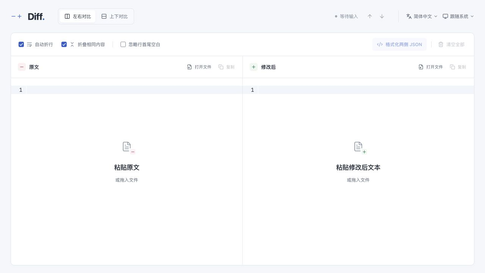
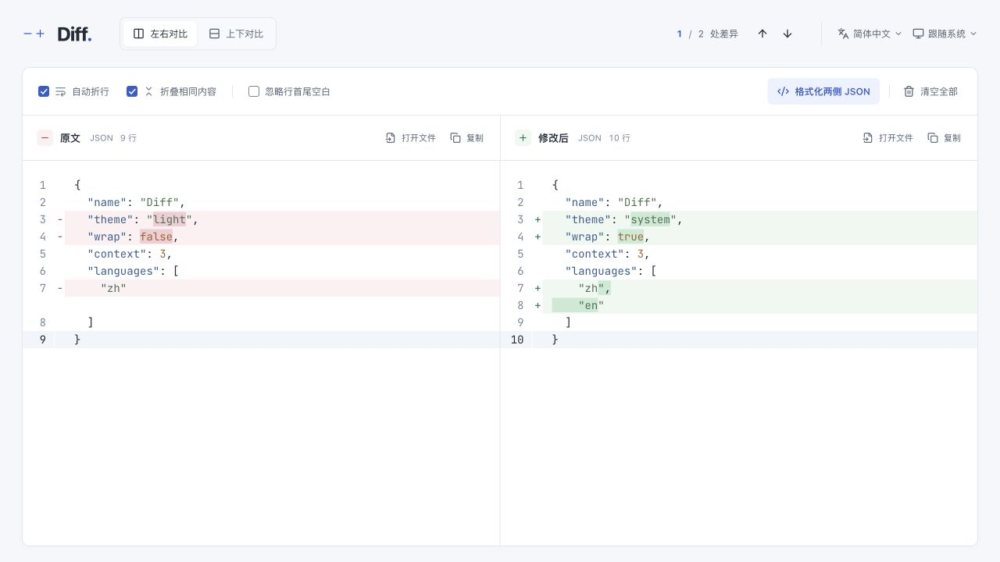
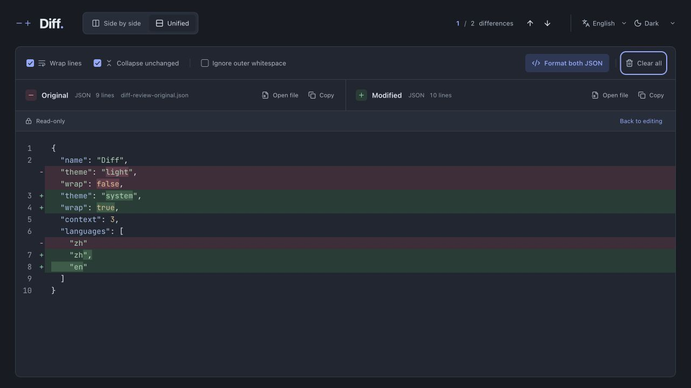

# Diff

基于 Astro + Vue 的文本差异对比工作台原型。支持中英文、明暗主题、左右编辑与只读上下对比。正文只在当前页面内存中处理，首次进入为空，不提供示例入口。

## 运行

需要 Node.js 22.13 或以上版本及 pnpm。

```sh
pnpm install
pnpm dev
```

在浏览器打开终端输出的本地地址。默认端口为 4321，被占用时可能自动选择其他端口。

```sh
pnpm check
pnpm test
pnpm build
pnpm preview
```

## 格式化与代码检查

```sh
pnpm format        # 自动格式化，并修复可自动处理的 ESLint / Stylelint 问题
pnpm format:check  # 只检查，不修改文件（含 lint）
pnpm lint          # ESLint + Stylelint
pnpm lint:eslint   # 单独检查 JS、TS、Vue、Astro
pnpm lint:style    # 单独检查 CSS 及 Vue / Astro 的 style 块
```

- JS、TS、Vue 使用 `@lai9fox/eslint-config` 的格式规则，通过 ESLint 修复；Astro 补充 `eslint-plugin-astro` 检查。
- Astro、CSS、JSON、YAML、Markdown 使用 Prettier；`.prettierignore` 排除 ESLint 负责的文件、构建产物和自动生成的锁文件。
- Stylelint 使用标准规则和 `postcss-html` 解析组件样式。允许 CodeMirror 的既有类名；全局样式按组件组织，因此不检查选择器的降序优先级。
- Astro ESLint 插件使用兼容 Node.js 22.13 的 1.x 系列。

## 交付文档

- [需求说明](docs/requirements.md)
- [UI / UX 设计说明](docs/ui-ux-design.md)：设计决策、颜色与字体、页面布局、关键流程、状态、中英文文案及可访问性。

## 已实现的原型交互

- 双侧输入、粘贴、编辑、撤销，文件选择与拖入，分别复制完整文本。
- 一键清空两侧正文和文件名，并可一次撤销清空；开始编辑或导入新内容后撤销入口消失。
- 行数显示在各侧标题旁，空白时隐藏；页面底部不设说明或统计栏。
- 行级与行内差异高亮、差异数量与导航、同步垂直滚动。
- 左右 / 上下切换、自动折行、相同内容折叠与局部展开。
- 忽略行首尾空白，保持行内空白和额外空行参与比较。
- 所有输入均按纯文本比较，不检测编程语言、不做语法着色。
- 简体中文 / English 切换，跟随系统 / 浅色 / 深色主题。
- 仅保存界面偏好，刷新后不恢复正文。

## 已实现的功能与特性

- **双侧输入与编辑**：左右双栏独立输入、粘贴、编辑、撤销（Undo/Redo），支持本地文本文件选择与拖拽导入，分别复制纯文本正文。
- **差异识别与标记**：
  - 行级与行内字符级差异高亮，配合 `+`、`−` 符号标识。
  - **中文/CJK 字符级精细对比**：解决长句中文仅改动个别字符时被整段标红/标绿的问题，精确高亮变化字符（通过验收标准 A03）。
  - **换行符等价性**：CRLF 与 LF 视为等价换行形式，仅在存在额外空行时识别差异（通过验收标准 A10）。
  - **忽略行首尾空白**：支持一键切换忽略行首尾空格与制表符，行内空格与空行严格保留对比（通过验收标准 A09）。
  - **JSON 文本对比**：直接按原始输入显示文本差异，不对键进行排序或重写（通过验收标准 A14）。
- **对比视图与同步**：
  - **左右视图**：默认可编辑双栏，内容行号对齐、占位对齐与垂直同步滚动；窗口缩放自动重新测算行高对齐。
  - **上下视图**：只读合并差异视图，删除行与新增行相邻排列，提供明显的“只读”标识与一键“返回编辑”入口。
  - **自动折行**：默认开启，关闭后支持横向滚动，不改写文本。
  - **折叠相同内容**：默认折叠连续相同行（保留 3 行上下文），支持单处局部展开、全部展开及恢复折叠。
- **差异导航与位置反馈**：
  - 统计真实差异块数量，显示格式如 `1 / 8 处差异` / `1 / 8 differences`，使用等宽数字排版避免跳动。
  - 提供上一处、下一处快捷跳转（支持快捷键 `Alt+↑` / `Alt+↓`、`F7` / `Shift+F7`），目标差异居中滚动。
  - **当前差异高亮指示**：跳转或光标停留在差异块内时，实时联动顶部计数并高亮激活差异块。
- **清空与撤销清空**：
  - 一键清空两侧正文和文件名，无干扰弹窗；保留布局、主题、语言及比较选项。
  - 按钮原位切换为“撤销清空”，可单次完全恢复两侧内容、文件名及行数；输入或导入新内容后撤销快照自动失效。
- **外观、语言与隐私**：
  - 支持简体中文与 English 即时切换。
  - 支持跟随系统、浅色、深色三套外观，预加载偏好防闪烁。
  - 纯浏览器本地处理，无服务端上传，不持久存储正文。

## 库与适配边界

- 编辑、撤销、差异计算和合并视图使用 CodeMirror 6 及官方扩展。
- 行首尾空白忽略、原文坐标映射和当前差异状态属于工作台适配；文件读取、剪贴板和存储使用浏览器原生 API。

## 验证记录

- `pnpm check`：TypeScript 类型检查 100% 通过（`vue-tsc --noEmit`）。
- `pnpm test`：差异规则自动化测试：
  - A01：相同文本输出 0 处差异
  - A03：中文长段落精细字符级对比
  - A09：忽略行首尾空白规则
  - A10：CRLF 与 LF 等价换行规则及空行检测
  - A14：JSON 纯文本差异对比
  - 映射坐标边界一致性验证
- `pnpm build`：Astro 静态站点构建成功。

## 界面截图

以下为移除 JSON 格式化功能前的历史截图，图中的格式化按钮、类型标签和语法着色已移除。本次未重新截图。截图内容是验证时临时输入的测试文本，不随页面加载，也没有示例入口。

### 空白初始状态



### 中文浅色双栏



### 英文深色上下视图


